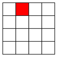
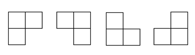
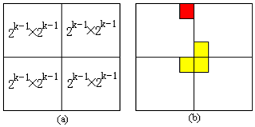

问题描述

在一个2^k×2^k 个方格组成的棋盘中，恰有一个方格与其他方格不同，称该方格为一特殊方格，且称该棋盘为一特殊棋盘。在棋盘覆盖问题中，要用图示的4种不同形态的L型骨牌覆盖给定的特殊棋盘上除特殊方格以外的所有方格，且任何2个L型骨牌不得重叠覆盖。

解题思路

分析：当k>0时，将2k×2k棋盘分割为4个2^k-1×2^k-1 子棋盘(a)所示。特殊方格必位于4个较小子棋盘之一中，其余3个子棋盘中无特殊方格。为了将这3个无特殊方格的子棋盘转化为特殊棋盘，可以用一个L型骨牌覆盖这3个较小棋盘的会合处，如 (b)所示，从而将原问题转化为4个较小规模的棋盘覆盖问题。递归地使用这种分割，直至棋盘简化为棋盘1×1。（出自算法设计与分析-王晓东）

