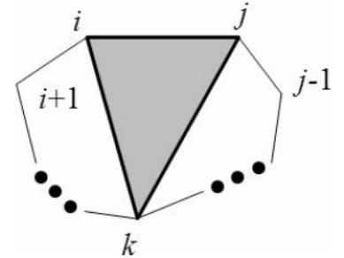

## 最优三角剖分。 

对于一个n个顶点的凸多边形，有很多种方法可以对它进行三角剖分（triangulation），即用n-3条互不相交的对角线把凸多边形分成n-2个三角形。 

为每个三角形规定一个权函数w(i, j, k)（如三角形的周长或3个顶点的权和），求让所有三角形权和最大的方案。

【分析】

本题和最优矩阵链乘问题十分相似，但存在一个显著不同：链乘表达式反映了决策过程，而剖分不反映决策过程。

举例来说，在链乘问题中，方案((A1A2)(A3(A4A5)))只能是先把序列分成A1A2和A3A4A5两部分。

而对于一个三角剖分，“第一刀”可以是任何一条对角线。

如果允许随意切割，则“半成品”多边形的各个顶点是可以在原多边形中随意选取的，很难简洁定义成状态，而“矩阵链乘”就不存在这个问题——无论怎样决策，面临的子问题一定可以用区间表示。 在这样的情况下，有必要把决策的顺序规范化，使得在规范的决策顺序下，任意状态都能用区间表示。

定义d(i, j)为子多边形i, i+1,…, j-1, j(i<j)的最优值，则边i-j在最优解中一定对应一个三角形i-j-k（i<k<j），如图9（注意顶点是按照逆时针编号的）。

因此，状态转移方程为：
```
d(i, j) = max{d(i, k) + d(k, j) + w(i, j, k) | i<k<j};
```
时间复杂度为O(n^3)，边界为d(i,i+1)=0，原问题的解为d(0,n-1)。

