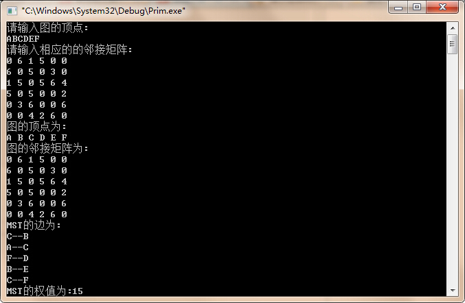

## 延时版本

将树分为了两部分，一部分是已经加入生成树的点，另一部分是没有加入生成树的点，用mark进行标记，建立一个优先队列存放所有的边的信息，每次从优先队列中选出一个最小的边，看两个顶点，如果两个顶点都已经存在于生成树之中，那么这条边就是无效的边，否则分别访问两个点，两个点访问过程中，发现相邻的边，并且加入优先队列，如果这个边的两个点都已经被mark标记过（也就是这个边已经加入了生成树），跳过。

- [实现](Prim_lazy.cpp)

- 复杂度

空间 E

时间 ElogE

## 即时版本

将树分为两部分，一部分是已经选择进入生成树的顶点，另一部分是没有选择进入生成树的顶点，已经进入生成树的点，存放在一个索引优先队列当中(注意这个队列一开始是空的)，索引的优先级按照besto[i]索引，而besto的含义是，在已经进入生成树中的点中距离i的最近的距离。

算法执行的时候，先从没有进入生成树中的点当中选择besto最小的那个id，将其加入生成树。

加入生成树之后进行更新操作，需要遍历和刚刚加入的那个点相邻的所有的点，但是已经加入的点（mark标记）当然是跳过的。

所以看下那些没有加入生成树的点会不会因为刚刚加入生成树的点的原因而更新了besto的数值。

如果是更新了（找到了更小的值），那么更改在优先队列中的信息，或者是加入优先队列。

- [实现](Prim_eager.cpp)

- 复杂度

空间 V

时间 ElogV

## 传统方法

- [O(V^2)的实现](Prim_V2.cpp)

- 运行结果

