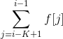
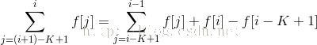

题意：N个牛 ，B表示朝后， F表示朝前，每次可以选择连续的K个牛反转方向，问如何选择K，使得操作数M最少，K也应尽量小。
参考博客：http://www.cnblogs.com/neopenx/p/4071801.html
①从第一头牛开始，如果朝前，不管了。看下一头牛，如果朝后反转K长度区间.....一直扫到区间结束。
②第一趟结束后，如果不符合要求，继续重复①，直到所有牛都朝前。

这样复杂度是O（n^3)，5000*5000*5000，标准TLE。

 

其实确定反转次数只需要扫一趟就行了，没有必要来回多趟。O（n^2)就能解决。

它的思路是这样的：

f[i]：区间[i,i+k-1]进行了反转的话为，否则为0。

为奇数的话，表示这头牛的方向与初始方向相反。

由上式可知，每一次都可以递推出来。

## Pr 

- POJ-3276-翻转牛
- POJ-3279-翻转格子
- POJ-3185-The_Water_Bowls
- POJ-1222-EXTENDED_LIGHTS_OUT
