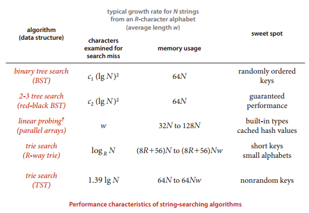

## 数据结构

  - 每个节点使用26个指针空间存放，下一个节点的信息。
  - 如果存在下一个字母，那么这个指针指向下一个节点的地址。
  - 如果不存在下一个字母，那么这个指针置为空。
  - 每个节点使用一个额外的空间存放计数的信息，统计截至当前节点代表的字母，是不是有字符串存在，如果有，存在几个。

## API

- 插入单词
- 查询单词存在字典中的个数，（包括模糊查询），输出全部的单词，
- 删除一个单词

## [Trie实现](Trie.cpp)

## 优化

- [三向单词查找树优化实现](3_trie.cpp)

使用空间远远小于普通的单词查找树：构造的链接数在3n-3nw之间

时间成本和普通的二叉查找树类似，取决于输入的情况，可能会严重的退化，导致效率不是很理想。

## 比较

