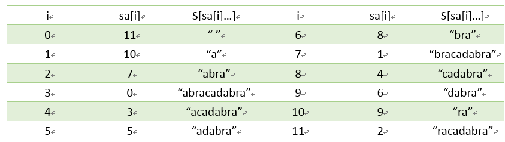
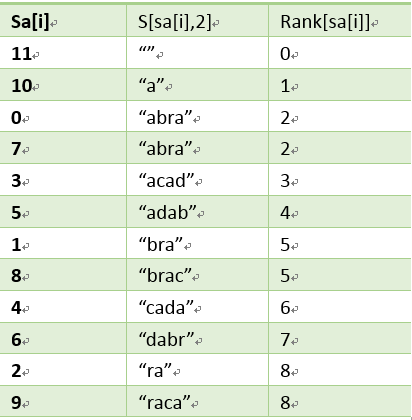
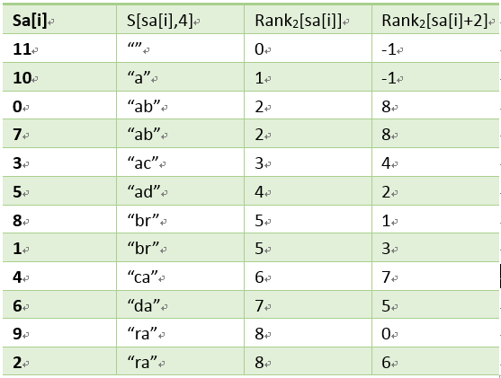

## 后缀数组

首先计算每个位置开始长度为2的子串的顺序，再利用这个结果计算长度为4的子串顺序，接下来计算长度为8的子串的顺序，不断倍增，直到长度大于等于n，就得到了所有的后缀数组。并且这些子串一定已经比较出了大小，即Rank[]中已经没有相同的值，那么此时的Rank值就是最后的结果。每一次排序都利用上次长度为2^(k-1)的字符串的Rank值，那么长度为2^k的字符串就可以用两个长度为2^(k-1)的字符串的排名作为关键字表示，然后进行排序，就得出了长度为2^k的字符串的Rank值。









```C++

using namespace std;
const int MAXN = 100000;
int n,k;
int Rank[MAXN+1];
int tmp[MAXN+1];

//比较(rank[i],rank[i+k])和(rank[j],rank[j+k])
bool compare_sa(int i ,int j)
{
    if (Rank[i]!= Rank[j]) return Rank[i] < Rank[j];
    else
    {
        int ri = i+k<=n? Rank[i+k] : -1;
        int rj = j+k<=n? Rank[j+k] : -1;
        return ri < rj;
    }
}

//计算字符串S的后缀数组
void construct_sa(string S,int *sa)
{
    n = S.length();
    //rank直接获取字符的编码
    for(int i = 0;i<=n;i++)
    {
        sa[i] = i;
        Rank[i] = i < n ? S[i] : -1;
    }
    //利用对长度为k的排序结果对长度为2k的排序
    for(k = 1; k <= n; k *= 2)
    {
        sort(sa,sa+n+1,compare_sa);
        //先在temp中临时存储新计算的rank，再转存回rank中
        tmp[sa[0]] = 0;
        for(int i = 1 ; i <= n; i++)
            tmp[sa[i]] = tmp[sa[i-1]] + (compare_sa(sa[i-1],sa[i])? 1: 0);
        for(int i = 0 ; i <= n; i++)
            Rank[i] = tmp[i];
    }
}

```


## 使用后缀数组计算高度数组

高度数组的定义是后缀数组排序后lcp[i] = S[sa[i]]与S[sa[i+1]]的最长公共前缀。
rank的性质 rank[sa[i]] = i;

这时候如果假设位置i对应的高度是hi，那么可以证明i+1对应的高度不小于hi - 1。

总的复杂度是O(n)。


```C++

int Rank[MAX_N];

//传入字符串S和对应的后缀数组sa，计算高度数组lcp
void construct_lcp(string S,int *sa,int *lcp){
    int n=S.length();
    for(int i=0;i<=n;i++)Rank[sa[i]]=i;

    int h=0;
    lcp[0]=0;
    for(int i=0;i<n;i++){
        //计算从位置i开始的后缀在后缀数组中的前一个后缀的lcp
        int j=sa[Rank[i]-1];
        //将h减去首字母的1长度，在保持前缀相同前提下不断增加
        if(h>0)h--;
        for(;j+h<n&&i+h<n;h++) {
            if(S[j+h]!=S[i+h])break;
        }
        lcp[Rank[i]-1]=h;
    }
}

```

- 如果与rmq结合，那么不光可以得到后缀数组内相邻两个后缀的最长公共前缀，还可以得到任意两个后缀的最长公共前缀。假设有rank[i] < rank[j]，那么从位置i和j开始的后缀的最长公共前缀，的长度就是lcp[rank[i]] ...lcp[rank[j] - 1]中的最小值。

- 思考：如何实现最长回文串？p385


## Pr

- POJ-3581-Sequence
- POJ-2217-最长公共字串
