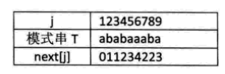

## 构建DFA

构建dfa的过程中最关键的是重启位置X的设置，以下图为例子


开始的时候我们设置重启位置X是0，而且第一列填充为全部零元，然后更新下匹配成功的字符对应的值，这里是```dfa['A'][0]```，就是在0这个索引下，如果匹配成功更新到j+1下一个字符，以后处理每一个字符的时候最后一步都会进行这一步更新。

然后进行第一步，j=1，这每一步的主要操作就是复制，上一个重启状态X (X代表前面已经求出的某一列) 的值，好，我们直接复制这一列的数值，当然要更新成功匹配的状态，最后更新重启状态X，也就是下一列要复制的那个“源”来自哪里呢？

下一个重启状态X其实就是，我们当前使用的重启状态，碰上当前更新的第j列代表的那个字符之后所处的位置啦！

```C++
#include<bits/stdc++.h>
using namespace std;
int kmp(string s,string t){
    const int n=t.size();
    int dfa[256][n+1];
    memset(dfa,0,sizeof(dfa));
    dfa[t[0]][0]=1;//设置开始成功状态
    int X=0;//和下一个元素的重启状态
    for(int j=1;j<n;j++){
        for(int i=0;i<256;i++){
            dfa[i][j]=dfa[X][j];//复制上一个重启状态的情况
        }
        dfa[t[j]][j]=j+1;//设置成功的时候的重启状态
        X=dfa[t[j]][X];//设置下一列的重启状态
    }
    //使用dfa
    int next=0;//初始的状态是0
    int i;
    for(i=0;i<s.size();i++){
        if(next==t.size()){
            break;
        }else{
            next=dfa[s[i]][next];
        }
    }
    if(next==t.size())return i-t.size();
    else return -1;
}

int main(){
    string s="zhanglan";
    string t="gla";
    cout<<kmp(s,t)<<endl;
}
```

## 构建next数组

一般的字符串匹配的时候，遇到不能匹配都会选择将模式的指针j回退到0，并将文本指针回退i，回退i-j个位置重新开始匹配，其实如果匹配失败，我们完全可以将i不回退，而将j回退到某一next[j]这个位置，这个位置能够保证什么呢？

这个位置能够保证，如果我们回退i和j指针再次进行匹配的时候我们进行的很大一部分工作是徒劳的，相反，我们不需要移动i指针只需要移动j指针到next[j]这个位置就好了。


构建next数组的过程：

next数组实际上是对称性的一种表现，看起来十分好理解，但是构建这个数组的时候有很大的技巧。



这里我们的下标是从0开始的因此只要全部减去1就好了。

6号是4的原因是检查1-5索引的元素。
[1,last=3]和[begin=3,5]是相等的，因此6号就是last+1=4了，(相等的下一位元素索引)。


下面这个算法的参考地址是[这里。](http://blog.csdn.net/yearn520/article/details/6729426)

```C++
vector<int> next(t.size(), 0);
for (int i = 1; i < t.size(); ++i) {
    int j = next[i - 1];
    while (j > 0 && t[i] != t[j]) j = next[j - 1];
    next[i] = (j += t[i] == t[j]);
}

//使用next数组进行匹配，如果需要使用这个数组进行匹配，需要全部减一处理
  
bool kmp(const string&s,const string&t){  
    int i=-1,j=-1;  
    if(s.size()<t.size())return false;  
    vector<int> next=get_next(t);  
    //注意size()是unsigned类型的，和int类型的比较的时候，会全部转化成无符号类型的。  
    int sn=s.size(),tn=t.size();  
  
    while(i<sn&&j<tn){  
        if(j==-1||s[i]==t[j]){  
            ++i,++j;  
        }else{  
            j=next[j];  
        }  
    }  
    return j==t.size();  
}  
  
int main(){  
    const string s="zhanglanqing";  
    const string t="qinh";  
    cout<<kmp(s,t)<<endl;  
}  

```
以上算法，有很大的技巧性，可以实际演算一遍。