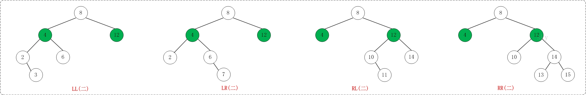

## 本文参考[地址](http://www.cnblogs.com/vincently/p/4225976.html)

## AVL树：

AVL树是一棵自平衡的二叉搜索树，在AVL树中任何节点的两个子树的高度最大差别为一，
所以它也被称为高度平衡树。查找、插入和删除在平均和最坏情况下都是O(lgN)

 
为什么需要AVL树：

大多数二叉查找操作（搜索、最大、最小、插入、删除...)会花费O(h)，h是二叉搜索树的高度。对于不平衡的二叉查找树，这些操作的时间复杂度为O(n)。
如果我们保证在每一次插入和删除之后树的高度为O(lgN)，那么我们就能保证对于所有的操作都有O(lgN)的上界。
AVL树的高度总是O(logN)，n是树中节点的数量。

 

## 旋转

如果在AVL树中进行插入或删除节点后，可能导致AVL树失去平衡。这种失去平衡的可以概括为4种姿态：
LL(左左)，LR(左右)，RR(右右)和RL(右左)。下面给出它们的示意图：

上图中的4棵树都是"失去平衡的AVL树"，从左往右的情况依次是：LL、LR、RL、RR。除了上面的情况之外，还有其它的失去平衡的AVL树，如下图：

上面的两张图都是为了便于理解，而列举的关于"失去平衡的AVL树"的例子。总的来说，AVL树失去平衡时的情况一定是LL、LR、RL、RR这4种之一，它们都由各自的定义：

(1) LL：LeftLeft，也称为"左左"。插入或删除一个节点后，根节点的左子树的左子树还有非空子节点，导致"根的左子树的高度"比"根的右子树的高度"大2，导致AVL树失去了平衡。
     例如，在上面LL情况中，由于"根节点(8)的左子树(4)的左子树(2)还有非空子节点"，而"根节点(8)的右子树(12)没有子节点"；导致"根节点(8)的左子树(4)高度"比"根节点(8)的右子树(12)"高2。

 

(2) LR：LeftRight，也称为"左右"。插入或删除一个节点后，根节点的左子树的右子树还有非空子节点，导致"根的左子树的高度"比"根的右子树的高度"大2，导致AVL树失去了平衡。
     例如，在上面LR情况中，由于"根节点(8)的左子树(4)的左子树(6)还有非空子节点"，而"根节点(8)的右子树(12)没有子节点"；导致"根节点(8)的左子树(4)高度"比"根节点(8)的右子树(12)"高2。

 

(3) RL：RightLeft，称为"右左"。插入或删除一个节点后，根节点的右子树的左子树还有非空子节点，导致"根的右子树的高度"比"根的左子树的高度"大2，导致AVL树失去了平衡。
     例如，在上面RL情况中，由于"根节点(8)的右子树(12)的左子树(10)还有非空子节点"，而"根节点(8)的左子树(4)没有子节点"；导致"根节点(8)的右子树(12)高度"比"根节点(8)的左子树(4)"高2。

 

(4) RR：RightRight，称为"右右"。插入或删除一个节点后，根节点的右子树的右子树还有非空子节点，导致"根的右子树的高度"比"根的左子树的高度"大2，导致AVL树失去了平衡。
     例如，在上面RR情况中，由于"根节点(8)的右子树(12)的右子树(14)还有非空子节点"，而"根节点(8)的左子树(4)没有子节点"；导致"根节点(8)的右子树(12)高度"比"根节点(8)的左子树(4)"高2。

 

前面说过，如果在AVL树中进行插入或删除节点后，可能导致AVL树失去平衡。AVL失去平衡之后，可以通过旋转使其恢复平衡，下面分别介绍"LL(左左)，LR(左右)，RR(右右)和RL(右左)"这4种情况对应的旋转方法。

 

2.1 LL的旋转

LL失去平衡的情况，可以通过一次旋转让AVL树恢复平衡。如下图：

图中左边是旋转之前的树，右边是旋转之后的树。从中可以发现，旋转之后的树又变成了AVL树，而且该旋转只需要一次即可完成。
对于LL旋转，你可以这样理解为：LL旋转是围绕"失去平衡的AVL根节点"进行的，也就是节点k2；而且由于是LL情况，即左左情况，就用手抓着"左孩子，即k1"使劲摇。将k1变成根节点，k2变成k1的右子树，"k1的右子树"变成"k2的左子树"。

 

2.2 RR的旋转

理解了LL之后，RR就相当容易理解了。RR是与LL对称的情况！RR恢复平衡的旋转方法如下：

图中左边是旋转之前的树，右边是旋转之后的树。RR旋转也只需要一次即可完成。

 

2.3 LR的旋转

LR失去平衡的情况，需要经过两次旋转才能让AVL树恢复平衡。如下图：

第一次旋转是围绕"k1"进行的"RR旋转"，第二次是围绕"k3"进行的"LL旋转"。

2.4 RL的旋转

RL是与LR的对称情况！RL恢复平衡的旋转方法如下：

第一次旋转是围绕"k3"进行的"LL旋转"，第二次是围绕"k1"进行的"RR旋转"。

## 插入：

　　向AVL树插入，可以透过如同它是未平衡的二叉查找树一样，把给定的值插入树中，接着自底往上向根节点折回，于在插入期间成为不平衡的所有节点上进行旋转来完成。因为折回到根节点的路途上最多有1.44乘log n个节点，而每次AVL旋转都耗费固定的时间，所以插入处理在整体上的耗费为O(log n) 时间。

 

## 删除：

　　从AVL树中删除，可以通过把要删除的节点向下旋转成一个叶子节点，接着直接移除这个叶子节点来完成。因为在旋转成叶子节点期间最多有log n个节点被旋转，而每次AVL旋转耗费固定的时间，所以删除处理在整体上耗费O(log n) 时间。

## 查找

　　可以像普通二叉查找树一样的进行，所以耗费O(log n)时间，因为AVL树总是保持平衡的。不需要特殊的准备，树的结构不会由于查找而改变。

## 扩展

添加了size的属性，能够方便的进行rank或者select的操作。具体的实现方法参考二叉搜索树或者红黑树的实现。

## 实现

[avl_tree.h](avl_tree.h)
[avl_tree.cpp](avl_tree.cpp)

