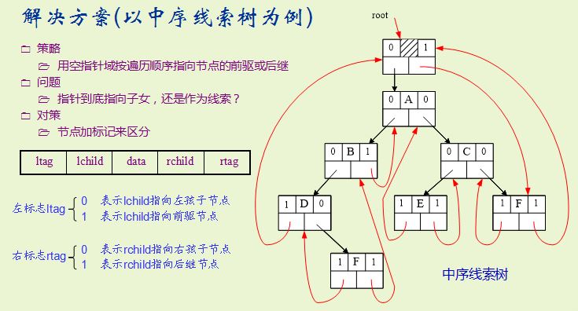

## 二叉树

### [线索二叉树建立实现](threadbitree.cpp)

- 例子




## 非递归遍历二叉树


- 方法一:

树的节点内部存在一个flag变量的时候可是使用这种方法,当然也可以使用unordered_map建立映射使用这种方法)

```
flag=0,表示从来没有访问过这个节点
flag=1表示访问过了左子树,但是没有访问右子树
flag=2,表示左右子树都已经访问结束
使用栈
if (stack_[cur-1].flag==0) {
    stack_[cur-1].flag=1;
    if(back->left==NULL){}
    else stack_[cur++]=Node(back->left);
} else if (stack_[cur-1].flag==1){
    res.push_back(back->val);
    cout<<back->val<<endl;
    stack_[cur-1].flag=2;
    if(back->right==NULL){}
    else stack_[cur++]=Node(back->right);
} else {
    cur--;
}
```

- 方法二：同样是使用栈来进行模拟，但是更加灵活

```
vector<TreeNode*> stk;
auto p=root;
while(p||stk.empty()==false){
    if(p){
        stk.push_back(p);p=p->left;
    }else{
        p=stk.back();
        stk.pop_back();
        cout<<p->val<<" ";
        p=p->right;
    }

```

使用这种方法,后续遍历不是很好写。

- 方法三：

仅仅保存parent的指针，非递归遍历。

```
prev记录上次visit的点，每次移动的时候更新，后面的实现省略这一步

while root:
    
    if root.parent == prev:
        访问这个root
        然后依次看left，right，parent是不是空，不是空，那么访问相应的对象
    elif root.left == prev:
        然后依次看right，parent是不是空，不是空，那么访问相应的对象
    else: (root.right == prev)
        root = root.parent

```

## clrs题目：[利用异或的性质使用单指针域实现双链表。](http://blog.csdn.net/zilingxiyue/article/details/43275617)


## 二叉树的层次遍历

比较简单，直接使用一个队列即可，但是有个问题是必须要明确的知道在哪一个位置，是每层的结束，因此需要定义一个变量来记录每层的个数，不断的减，当减到0的时候，说明这一层已经结束，并且下一层的个数，就是当前队列的元素的个数。详细的过程可以参考[这里。](https://leetcode.com/problems/binary-tree-level-order-traversal-ii/#/description)

## Pr

- UVA-679-小球下落与开关
- UVA-122-树的层次遍历
- UVA-548-树的递归遍历
- UVA-839-天平（本题很重要）
- UVA-699-下落的树叶
- UVA-297-画四分树