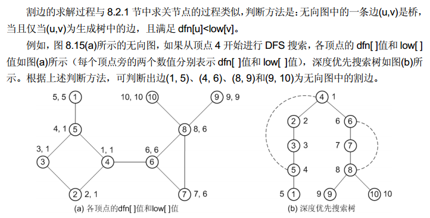
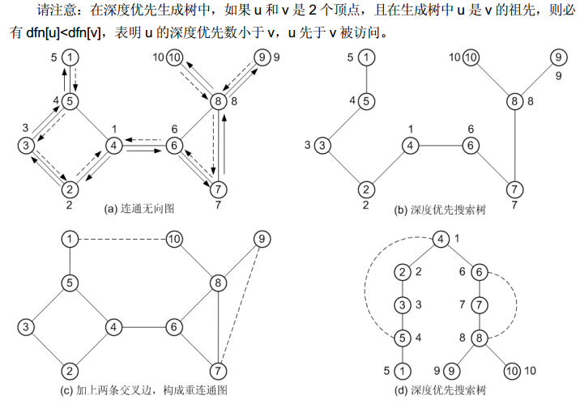

<<算法4th>>这本书的一个优点就是工程性很强,设计模式使用的很好,这可能也是java本身的优点吧.

这一节的内容将,注重设计模式的使用.

##[图的API实现](Graph.cpp)

- 常见的图论泛型操作
  - 最大度
  - 平均度
  - 自环的数目
  - ...


##无向图的表示方法


图的表示方法的复杂度


| 数据结构  |  空间   | 添加一条边 | 检查相邻 | 遍历与V相邻的点 |
| --------: | -------: | -------: | --------: | -------: |
| 边的列表  |    E    |    1    |     E    |    E    |
| 邻接矩阵  |   V*V   |    1    |    1     |    V    |
| 邻接表    |   E+V   |    1    | degree(V)|degree(V)|
| 邻接集合  |E+V       |logV    |logV      |logv+degree(V)|

##基础算法

###[广度优先搜索寻找路径](BreadthFirstPaths.cpp)

###[寻找联通分量](CC.cpp)

###[寻找内部的环](Cycle.cpp)

###[深度优先搜索](DepthFirstSearch.cpp)

###[深度优先搜索寻找路径](DepthFirstPaths.cpp)


- 深度优先搜索O(n+2m)
- 深度优先搜索寻找路径的时间和路径的长度成正比
- 广度优先搜索O(n+2m)
- 广度优先搜索找到的路径一定是最短的，深度优先搜索则不一定
- unionfind算法不能够找到路径，但是更加适合动态的查询


####检查是否有环的思想：

建立一个栈，按照dfs的过程进行模拟，如果一个点的邻接定点（不包括传入的那个点）已经访问过了，那么就是存在环的，按照路径记录数组edgeto遍历即可

##算法应用

###[判断一个图是不是二分图](Bipartite.cpp)

###[求无向图中的桥和边双连通分量](findbrige.cpp)



- 边的双连通分量求解


边双连通分量的求法更为简单。只需在求出所有的桥以后，把桥删除，原图变成了多个连通块，则每个连通块就是一个边双连通分量。桥不属于任何一个边双连通分量，其余的边和每个顶点都属于且只属于一个边双连通分量。

###[求无向图中的关节点和重联通分量Tarjan算法](findarticulationpoints.cpp)

- O(n*n)



图中具有2种边：树边，回边，交叉边(有向图中才有)
顶点 u 是关节点的充要条件：

- 如果顶点 u 是深度优先搜索生成树的根， 则 u 至少有 2 个子女。
- 如果 u 不是生成树的根，则它至少有一个子女 w，从 w 出发，不可能通过 w、 w 的子
孙，以及一条回边组成的路径到达 u 的祖先。

```
low[u] = Min
{
dfn[u],
Min{ low[w] | w 是 u 的一个子女}, (8-2)
Min{ dfn[v] | v 与 u 邻接，且(u,v)是一条回边 }
}
```

“low[w]>=dfn[u]”的含义是：顶点 u 的子女顶点 w，能够通过如前所述的路径到达顶点的最低深度优先数大于等于顶点 u 的深度优先数（注意在深度优先生成树中，顶点 m 是顶点 n的祖先，则必有 dfn[m]<dfn[n]），即 w 及其子孙不存在指向顶点 u 的祖先的回边。这时删除顶点 u及其所关联的边，则以顶点 w 为根的子树就从搜索树中脱离了。


###[欧拉路径](EulerianCycle.cpp)

###[欧拉路径]

###[Hopcroft-Tarjan算法判断是不是平面图]

###[顶点联通度的求解]

###[边联通度的求解]


##拓展
- [迷宫游戏](maze.cpp)
- Brute force: delete edge (or vertex) and check connectivity. Takes O(E(V + E)) and O(V(V + E)) time, respectively. Can improve both to O(E + V) using clever extension to DFS ?
