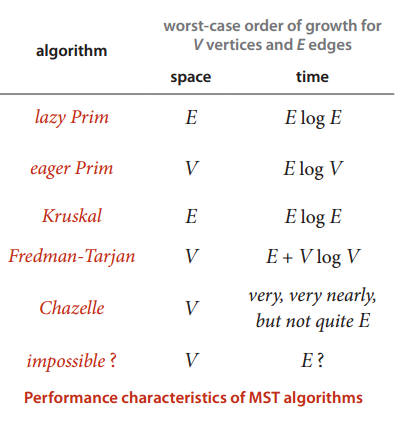
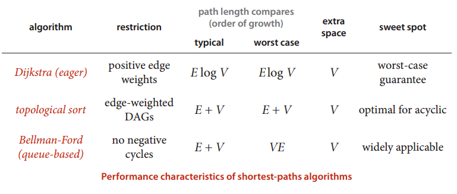

# 最小生成树

## 延时版本

将树分为了两部分，一部分是已经加入生成树的点，另一部分是没有加入生成树的点，用mark进行标记，建立一个优先队列存放所有的边的信息，每次从优先队列中选出一个最小的边，看两个顶点，如果两个顶点都已经存在于生成树之中，那么这条边就是无效的边，否则分别访问两个定点，两个定点访问过程中，发现相邻的边，并且加入优先队列，如果这个边已经失效了，跳过。

- [实现](Prime_lazy.cpp)


## 即时版本

将树分为两部分，一部分是已经选择进入生成树的顶点，另一部分是没有选择进入生成树的顶点，没有已经进入生成树的点，存放在一个索引优先队列当中(注意这个队列一开始是空的)，索引的优先级按照besto[i]索引，而besto的含义是，在已经进入生成树中的点中选择的一条距离i的最近的距离。

算法执行的时候，先从没有进入生成树中的点当中选择besto最小的那个id，将其加入生成树。

加入生成树之后进行更新操作，看下哪些没有加入生成树的点会不会因为刚刚加入生成树的点的原因而更新了besto的数值，如果是更新了，那么更改在优先队列中的信息，或者是加入优先队列。

- [实现](Prim.cpp)




## [O(n^2)的实现](prim_n2.cpp)


# 最短路

思想很简单：将disto最小的非树顶点加入树中，并且放松这个定点指出去的边

## 基于优先队列的Dijkstar实现

将没有加入生成树的点，放入一个索引优先队列中，索引值是disto，不断的从优先队列中选择出disto最小的定点，加入到生成树中，并且访问这个点，访问过程如下：放松这个点指出的所有的边，如果指向的那个定点，被发现更新了数值，那么就要加入到优先队列中。

当然这样会出现一个问题就是，同一个点，可能加入生成树之后，又被加入到优先队列中去，这里有两中选择方案，一种是在放松的过程中如果发现了已经访问过的点，就不要加入（所谓即时版本），另一种方案是在从优先队列中取出之后检查是不是已经访问过，如果已经访问过，就跳过。（所谓延时版本）

- [实现](Dijkstra.cpp)


## Bellmanford

- Dijkstra不能实现存在负权值边的情况下的最短路的求解，同样不能实现含有负权值回路的情况下的最短路的求解

Bellmanford算法的思想，以任意的顺序放松图中的所有的边，共进行V轮


- 套汇问题：

将原图中的所有边的权重之积的计算转化成求lg然后取反的最短路计算，然后检查是否含有负权值回路即可，当然，也可以修改bellford算法，看是否有权值之和>1的回路出现。


- [简洁的实现](bellmanford.cpp)

- 可以采用队列实现


实现过程中将队列中出队的点进行放松操作，我们这里修改了放松的操作，将放松的边的指向的点，加入队列，但是队列中不要重复出现相同的点，并且周期性的检查已经修改好的图中是否存在环，检查周期是每当放松的数量能被V整除的时候。

java实现的代码如下

```

public BellmanFordSP(EdgeWeightedDigraph G, int s) {
        distTo  = new double[G.V()];
        edgeTo  = new DirectedEdge[G.V()];//存放已经修改好的图的信息
        onQueue = new boolean[G.V()];
        for (int v = 0; v < G.V(); v++)
            distTo[v] = Double.POSITIVE_INFINITY;
        distTo[s] = 0.0;

        // Bellman-Ford algorithm
        queue = new Queue<Integer>();
        queue.enqueue(s);
        onQueue[s] = true;
        while (!queue.isEmpty() && !hasNegativeCycle()) {
            int v = queue.dequeue();
            onQueue[v] = false;
            relax(G, v);
        }
    }

private void relax(EdgeWeightedDigraph G, int v) {
    for (DirectedEdge e : G.adj(v)) {
        int w = e.to();
        if (distTo[w] > distTo[v] + e.weight()) {
            distTo[w] = distTo[v] + e.weight();
            edgeTo[w] = e;
            if (!onQueue[w]) {
                queue.enqueue(w);
                onQueue[w] = true;
            }
        }
        if (cost++ % G.V() == 0) {
            findNegativeCycle();
            if (hasNegativeCycle()) return;  // found a negative cycle
        }
    }
}

findNegativeCycle()使用有向图中的寻找环算法实现

```




