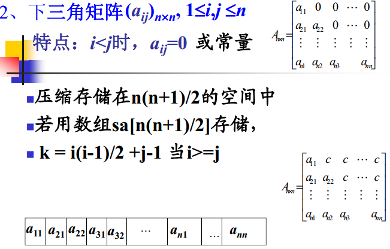
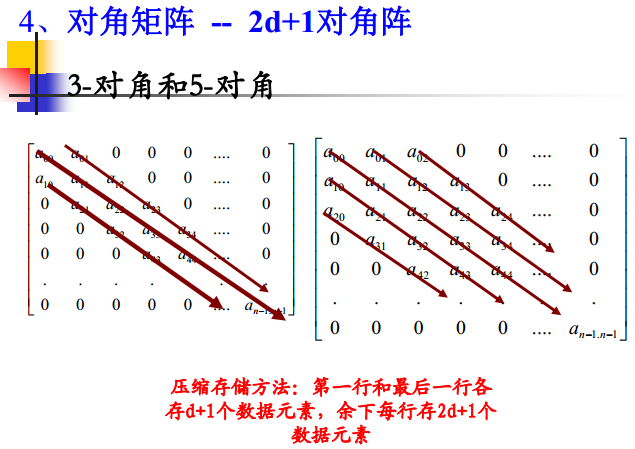
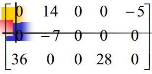
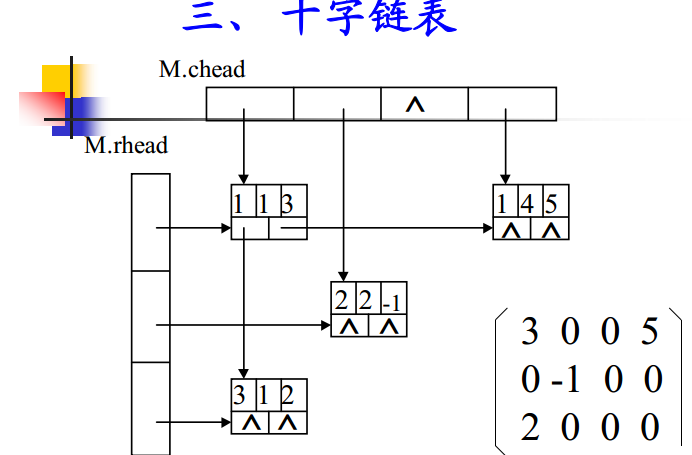

# 1.顺序单链表

### [就地逆置](reverse.cpp)

### [实现字典](template_linklistst.h)

### [多项式加法](polynomial_add.cpp)

### [用数组模拟](simulate_list.cpp)

# 2.[顺序循环双链表](binarylooplist.cpp)


# 3.栈的应用

### [如何求表达式的值](calculator.cpp)

# 4.[双端队列的实现](deque.cpp)


# 5.特殊矩阵


 




```
矩阵元素下表从0开始的地址计算公式：
Loc(aij)=Loc(a00)+(2d+1)*i-d+j-i+d
0<=i,j<=n-1, |i-j|<=d
矩阵元素下表从1开始的地址计算公式：
Loc(aij)=Loc(a11)+(2d+1)*(i-1)-d+j-i+d
= Loc(a11)+(2d+1)*(i-1)+j-I
1<=i,j<=n, |i-j|<=d
```


# 6.一般矩阵

### [三元组顺序表快速转置算法](FastTransposeSMatrix.cpp)



### 十字链表




# 7.二叉树

### [常见二叉树的算法](bitree.cpp)


### [线索二叉树](threadbitree.cpp)


#### 非递归遍历二叉树
- 方法一:(树的节点内部存在一个flag变量的时候可是使用这种方法,当然也可以使用unordered_map建立映射使用这种方法)

```
flag=0,表示从来没有访问过这个节点
flag=1表示访问过了左子树,但是没有访问右子树
flag=2,表示左右子树都已经访问结束
使用栈
if (stack_[cur-1].flag==0) {
    stack_[cur-1].flag=1;
    if(back->left==NULL){}
    else stack_[cur++]=Node(back->left);
} else if (stack_[cur-1].flag==1){
    res.push_back(back->val);
    cout<<back->val<<endl;
    stack_[cur-1].flag=2;
    if(back->right==NULL){}
    else stack_[cur++]=Node(back->right);
} else {
    cur--;
}
```

- 方法二：同样是使用栈来进行模拟，但是更加灵活

```
vector<TreeNode*> stk;
auto p=root;
while(p||stk.empty()==false){
    if(p){
        stk.push_back(p);p=p->left;
    }else{
        p=stk.back();
        stk.pop_back();
        cout<<p->val<<" ";
        p=p->right;
    }

```

使用这种方法,后续遍历不是很好写。