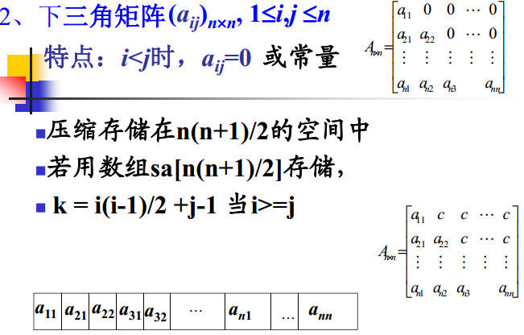
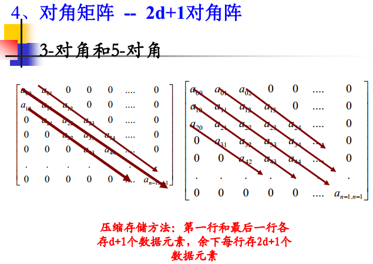
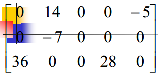
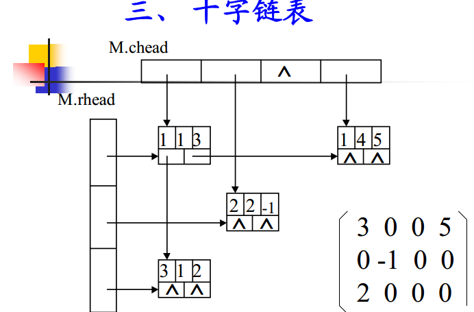

##特殊矩阵
 
-------------------------------
##


```
矩阵元素下表从0开始的地址计算公式：
Loc(aij)=Loc(a00)+(2d+1)*i-d+j-i+d
0<=i,j<=n-1, |i-j|<=d
矩阵元素下表从1开始的地址计算公式：
Loc(aij)=Loc(a11)+(2d+1)*(i-1)-d+j-i+d
= Loc(a11)+(2d+1)*(i-1)+j-I
1<=i,j<=n, |i-j|<=d
```
##一般矩阵
###[三元组顺序表快速转置算法](FastTransposeSMatrix.cpp)


###行逻辑联接的顺序表
为了防止随机存取每一行的非零元的时候要顺序查找，为此建立一个每一行开始的下标的索引
```
pos[];
```
###十字链表

