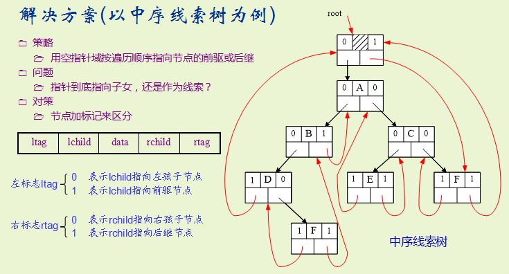

#二叉树的算法
###[常见二叉树的算法](bitree.cpp)

* 建立二叉树
* 非递归先序中序，后续遍历二叉树


####非递归遍历二叉树
- 方法一:(树的节点内部存在一个flag变量的时候可是使用这种方法,当然也可以使用unordered_map建立映射使用这种方法)

中序遍历:
```
flag=0,表示从来没有访问过这个节点
flag=1表示访问过了左子树,但是没有访问右子树
flag=2,表示左右子树都已经访问结束
使用栈
if(stack_[cur-1].flag==0){
    stack_[cur-1].flag=1;
    if(back->left==NULL){}
    else stack_[cur++]=Node(back->left);
}else if(stack_[cur-1].flag==1){
    res.push_back(back->val);
    cout<<back->val<<endl;
    stack_[cur-1].flag=2;
    if(back->right==NULL){}
    else stack_[cur++]=Node(back->right);
}else{
    cur--;
}
```

先序遍历和后序遍历的道理相同，只不过是访问访问函数的位置有变化

- 方法二：同样是使用栈来进行模拟，但是更加灵活

```
vector<TreeNode*> stk;
auto p=root;
while(p||stk.empty()==false){
    if(p){
        stk.push_back(p);p=p->left;
    }else{
        p=stk.back();
        stk.pop_back();
        cout<<p->val<<" ";
        p=p->right;
    }

```
使用这种方法，先序遍历也很简单，但是后续遍历不是很好写。

###[线索二叉树](threadbitree.cpp)



###树的应用-并查集

- [根据树的大小进行合并的并查集](quick_union_with_size.cpp)
- [路径压缩的并查集](quick_union_compress.cpp)

