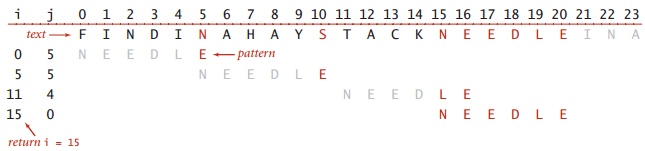

## Boyer-Moore算法

对于任何一个模式字符串，我们统计字母表中的每一个字符出现在模式字符串中的位置，建立right数组，如果模式字符串中没有当前字母表中的字母，那么这个right[c]设置为-1，原因下面解释。

对于模式字符串和文本字符串，同时进行移动(需要注意的是模式字符串的指针是从结尾开始移动的，也就是说j的值从m-1到0变化)，如果匹配失败，那么

1.如果失败的文本字符不出现在模式字符串中，那么直接将模式字符串右移j+1个单位，如果移动的距离小于j+1，那么又有很多的比较是不必要的。

2.如果失败的文本字符出现在模式字符床中，那么使用right数组，将文本和模式对其。

这里我们移动文本指针模拟，因此是将i增加j-rght[当前字符]

- 为了将上述两种方法同时整合起来，
- 我们规定right的缺省值为-1，这样能够实现右移j+1的构想。

具体的可以[参考实现。](boyermoore.cpp)

