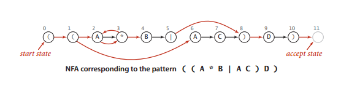
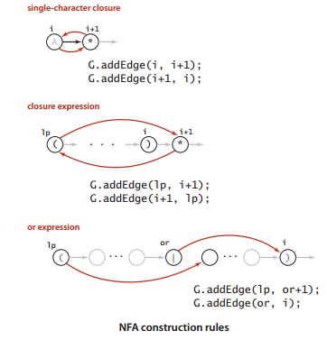

## 正则表达式

首先对于一个正则表达式```((A*B|AC)D)```我们需要构造一个如图NFA中的红色的线段，因为黑色的线段不用考虑，默认是相邻的。



加入我们现在已经构造好了如图的红色线段存放在有向图中，现在我们模拟NFA的运行。

- 给定一个文本```AABD```
- 入口选择为0,在图中进行dfs，找A那个状态，能够达到的状态集合是2,6
- 入口选择为3,7(上一个集合的末状态+1)为入口，进行dfs，找A那个状态，能够到达的集合是2
- 入口选择为3，进行dfs，找B那个状态，能够到达的集合是4
- 入口选择为5，进行dfs，找D那个状态，能够到达的集合是9
- 入口选择为10,进行dfs，得到集合后，不用再寻找状态了，因为得到的集合中就有末状态11了

- 现在讨论如何构建DFA



```
void construct_grep(string t){
    memset(G,0,sizeof(G));
    vector<int> stack;
    int M=t.size();
    for(int i=0;i<M;i++){
        int lp=i;//如果不是左括号的话，那么lp本身就是i
        if(t[i]=='('||t[i]=='|'){//“|”一定出现在()中，使用栈模拟
            stack.push_back(i);//栈中的元素只有()|三种
        }
        if(t[i]==')'){
            int Or=stack.back();
            stack.pop_back();
            if(t[Or]=='|'){
                lp=stack.back();
                stack.pop_back();
                G[lp][Or+1]=1;
                G[Or][i]=1;
            }else{
                lp=Or;//如果不是'|'的话，那么lp就是前前面的那个左括号
            }
        }
        //看下一个元素是不是*
        if(i<M-1 && t[i+1]=='*'){
            G[lp][i+1]=G[i+1][lp]=1;
        }
        //默认添加一条指向下个元素的一条边
        if(t[i]=='('||t[i]=='*'||t[i]==')'){
            G[i][i+1]=1;
        }
    }
}
```
这个构造算法，看似十分简单，但是要想高效的进行，是有一定的技巧的。


- [完整实现](grep.cpp)