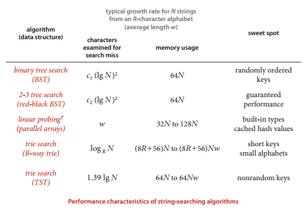
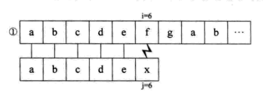
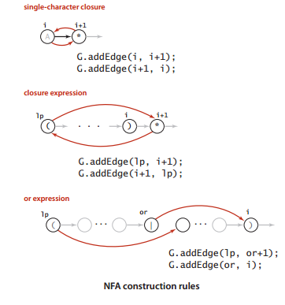

# 字符串排序算法

## [实现](string_same_length_lsd.cpp)

字符串集合的长度指定了，按照最低位优先的顺序排序

## [实现](string_diff_length_msd.cpp)

字符串的长度没有指定，按照最高位优先的顺序进行排序


## [实现](3_partation_string_sort.cpp)

三项切分的快速排序应用到，字符串排序


# 单词查找树(Trie)


#### 数据结构

  - 每个节点使用26个指针空间存放，下一个节点的信息
  - 如果存在下一个字母，那么这个指针指向下一个节点的地址
  - 如果不存在下一个字母，那么这个指针置为空
  - 每个节点使用一个额外的空间存放计数的信息，统计截至当前节点代表的字母，是不是有字符串存在，如果有，存在几个

#### API

- 插入单词
- 查询单词存在字典中的个数，（包括模糊查询），输出全部的单词，
- 删除一个单词

#### [实现](Trie.cpp)

#### [三向单词查找树优化](3_trie.cpp)


使用空间远远小于普通的单词查找树：构造的链接数在3n-3nw之间

时间成本和普通的二叉查找树类似，取决于输入的情况，可能会严重的退化，导致效率不是很理想，但是一般情况下符合。





# 字符串匹配

## [kmp构建DFA](kmp_dfa.cpp)

构建dfa的过程中最关键的是重启位置X的设置，以下图为例子


开始的时候我们设置重启位置X是0，而且第一列填充为全部零元，然后更新下匹配成功的字符对应的值，这里是```dfa['A'][0]```，就是在0这个索引下，如果匹配成功更新到j+1下一个字符，以后处理每一个字符的时候最后一步都会进行这一步更新。

然后进行第一步，j=1，这每一步的主要操作就是复制，上一个重启状态X (X代表前面已经求出的某一列) 的值，好，我们直接复制这一列的数值，当然要更新成功匹配的状态，最后更新重启状态X，也就是下一列要复制的那个“源”来自哪里呢？

下一个重启状态X其实就是，我们当前使用的重启状态，碰上当前更新的第j列代表的那个字符之后所处的位置啦！

```
int kmp(string s,string t){
    const int n=t.size();
    int dfa[256][n+1];
    memset(dfa,0,sizeof(dfa));
    dfa[t[0]][0]=1;//设置开始成功状态
    int X=0;//和下一个元素的重启状态
    for(int j=1;j<n;j++){
        for(int i=0;i<256;i++){
            dfa[i][j]=dfa[X][j];//复制上一个重启状态的情况
        }
        dfa[t[j]][j]=j+1;//设置成功的时候的重启状态
        X=dfa[t[j]][X];//设置下一列的重启状态
    }
}
```

## kmp构建next数组

一般的字符串匹配的时候，遇到不能匹配都会选择将模式的指针j回退到0，并将文本指针回退i，回退i-j个位置重新开始匹配，其实如果匹配失败，我们完全可以将i不回退，而将j回退到某一next[j]这个位置，这个位置能够保证什么呢？

这个位置能够保证，如果我们回退i和j指针再次进行匹配的时候我们进行的很大一部分工作是徒劳的，相反，我们不需要移动i指针只需要移动j指针到next[j]这个位置就好了




构建next数组的过程

next数组实际上是对称性的一种表现，看起来十分好理解，但是构建这个数组的时候有很大的技巧


这里我们的下标是从0开始的因此只要全部减去1就好了

6号是4的原因是检查1-5索引的元素
[1,last=3]和[begin=3,5]是相等的，因此6号就是last+1=4了,(相等的下一位元素索引)


```
vector<int> get_next(const string&s){
    vector<int> next(s.size());
    int i=0,j=-1;
    next[0]=-1;
    while(i<s.size()){
        if(j==-1||s[i]==s[j]){
            ++i,++j;
            next[i]=j;
        }else{
            j=next[j];//这一步很关键
        }
    }
    return next;
}

```
以上算法，有很大的技巧性，可以实际演算一遍。


## [Boyer-Moore算法](boyermoore.cpp)

对于任何一个模式字符串，我们统计字母表中的每一个字符出现在模式字符串中的位置，建立right数组，如果模式字符串中没有当前字母表中的字母，那么这个right[c]设置为-1,原因下面解释


对于模式字符串和文本字符串，同时进行移动(需要注意的是模式字符串的指针是从结尾开始移动的，也就是说j的值从m-1到0变化)，如果匹配失败，那么

1.如果失败的文本字符不出现在模式字符串中，那么直接将模式字符串右移j+1个单位(模式字符串的长度)，如果移动的距离小于j+1，那么又有很多的比较是不必要的。
2.如果失败的文本字符出现在模式字符床中，那么使用right数组，将文本和模式对其。
这里我们移动文本指针模拟
因此是将i增减j-rght[当前字符]
- 为了将上述两种方法同时整合起来，
- 我们规定right的缺省值为-1，这样能够实现右移j+1的构想


## [Rabinkarp算法_hash方法](rabin_karp.cpp)

## 总结


# [正则表达式](grep.cpp)
首先对于一个正则表达式```((A*B|AC)D)```我们需要构造一个如图NFA中的红色的线段，因为黑色的线段不用考虑，默认是相邻的。

加入我们现在已经构造好了如图的红色线段存放在有向图中，现在我们模拟NFA的运行。

- 给定一个文本```AABD```
- 入口选择为0,在图中进行dfs，找A那个状态，能够达到的状态集合是2,6
- 入口选择为3,7(上一个集合的末状态+1)为入口，进行dfs，找A那个状态，能够到达的集合是2
- 入口选择为3，进行dfs，找B那个状态，能够到达的集合是4
- 入口选择为5，进行dfs，找D那个状态，能够到达的集合是9
- 入口选择为10,进行dfs，得到集合后，不用再寻找状态了，因为得到的集合中就有末状态11了

- 现在讨论如何构建DFA


```
void construct_grep(string t){
    memset(G,0,sizeof(G));
    vector<int> stack;
    int M=t.size();
    for(int i=0;i<M;i++){
        int lp=i;//如果不是左括号的话，那么lp本身就是i
        if(t[i]=='('||t[i]=='|'){//“|”一定出现在()中，使用栈模拟
            stack.push_back(i);//栈中的元素只有()|三种
        }
        if(t[i]==')'){
            int Or=stack.back();
            stack.pop_back();
            if(t[Or]=='|'){
                lp=stack.back();
                stack.pop_back();
                G[lp][Or+1]=1;
                G[Or][i]=1;
            }else{
                lp=Or;//如果不是'|'的话，那么lp就是前前面的那个左括号
            }
        }
        //看下一个元素是不是*
        if(i<M-1 && t[i+1]=='*'){
            G[lp][i+1]=G[i+1][lp]=1;
        }
        //默认添加一条指向下个元素的一条边
        if(t[i]=='('||t[i]=='*'||t[i]==')'){
            G[i][i+1]=1;
        }
    }
}
```
这个构造算法，看似十分简单，但是要想高效的进行，是有一定的技巧的。


# 后缀数组

目的是寻找一个字符串中最长的重复的子字符串
假设比较两个子字符串的复杂度是m
字符串的长度是n

- 暴力方法**O(n*n*m)**
- 后缀数组的方法，O(n) + O(nlogn) + O(n*m)


# [哈夫曼编码](haffmancode.cpp)