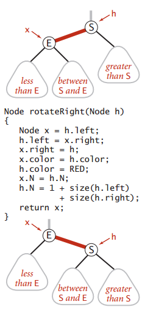
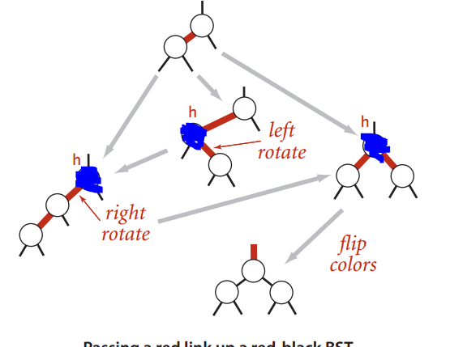
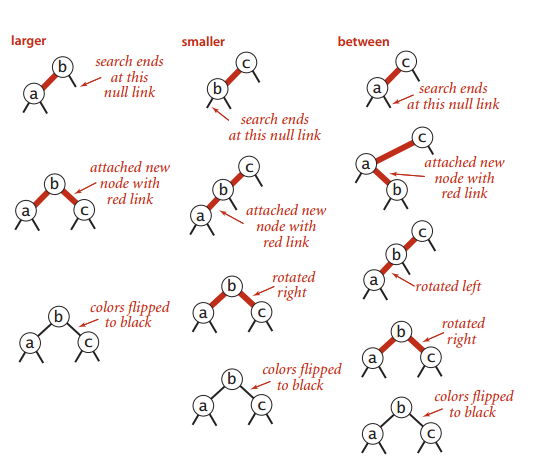

##[链表(顺序查找)](template_linklistst.h)

##[二分查找](template_binarysearchst.h)
- [简洁的实现](binary_search.cpp)
- 可以使用迭代或者递归实现
- 最多lgN+1次比较
- 和普通查找的区别


##[二叉查找树](template_bitreesearchst.h)


-  所有的操作在最坏的情况下和树的高度成正比
-  随机键构造的二叉树中，查找命中平均所需要的比较次数是2lnN，插入和查找未命中比较次数为2lnN

- 与其他的比较


| 算法 | 最坏的情况下的运行时间的增长数量级 | 平均情况下的.|是否支持有序性相关的操作|
| --------: | -------: | -------: | --------: |
|顺序查询| N(search),N(insert)|N/2(search),N(insert)|NO|
|二分查询|lgN(search),N(insert)|lgN(search),N/2(insert)|YES|
|二叉树查找| N(search),N(insert)|1.39lgN(search),1.39lgN(insert)|YES|


- 注：删除算法，对于不是根节点的节点，我们可以采用一种比较好理解的方法：
  - 先找出右子树中的最小值，用这个最小值替换这个值然后递归的删除


```
template<typename T>
void Remove(TreeNode* &p, const T& k) {
    if (p == NULL) return;
    if (p->key > k) {
        Remove(p->left, k);
    }else if (p->key < k) {
        Remove(p->right, k);
    } else if (p->left != NULL && p->right != NULL) {
        p->key = FindMin(p->right)->key; //用右子树最小节点键值代替要删除节点的键值
        Remove(p->right, p->key);
    } else {
        TreeNode* temp = p;
        p = p->left ? p->left : p->right;
        delete temp; 
    }
}
```


##平衡查找树

###2-3树

定义：一个节点要么是2节点要么是3节点

2节点：一个键+两个孩子/一个键没有孩子

3节点：两个键+三个孩子/两个键

并且满足<的关系

[插入操作](http://algs4.cs.princeton.edu/33balanced/)

###红黑树的插入操作

- 基础的旋转操作



- 实质上使用红黑分支模拟2-3树的插入操作

- 我们对于一个节点分别检查这三种情况



- 通过递归的方式，我们能够实现下面的几种情况



###AVL平衡树
[参考文章](http://www.cnblogs.com/vincently/p/4225976.html)

- AVL树，经典平衡树，所有操作的最坏复杂度是O(lgN)的。

一共有四种旋转方式


- [AVL头文件](avl_tree.h)
- [AVL实现](avl_tree.cpp)


###B树

- B树就是二叉查找树


###B-树


B-树是一种多路搜索树（并不是二叉的）：

1.定义任意非叶子结点最多只有M个儿子；且M>2；

2.根结点的儿子数为[2, M]；

3.除根结点以外的非叶子结点的儿子数为[M/2, M]；

4.每个结点存放至少M/2-1（取上整）和至多M-1个关键字；（至少2个关键字）

5.非叶子结点的关键字个数=指向儿子的指针个数-1；

6.非叶子结点的关键字：K[1], K[2], …, K[M-1]；且K[i] < K[i+1]；

7.非叶子结点的指针：P[1], P[2], …, P[M]；其中P[1]指向关键字小于K[1]的子树，P[M]指向关键字大于K[M-1]的子树，其它P[i]指向关键字属于(K[i-1], K[i])的子树；

8.所有叶子结点位于同一层；
		
9.B-树的搜索，从根结点开始，对结点内的关键字（有序）序列进行二分查找，如果命中则结束，否则进入查询关键字所属范围的儿子结点；重复，直到所对应的儿子指针为空，或已经是叶子结点；
		


```
n+1>=2*(m/2)^(k-1)
k<=log[(n+1)/2]/log(m/2) + 1
```

###B+树


B+树的设计主要是为了解决在遍历过程中可能会出现同1个节点访问多次的情况
适合文件系统

1.其定义基本与B-树同，除了：
	
2.非叶子结点的子树指针与关键字个数相同；
	
3.非叶子结点的子树指针P[i]，指向关键字值属于[K[i], K[i+1])的子树（B-树是开区间）；
	
5.为所有叶子结点增加一个链指针；
	
6.所有关键字都在叶子结点出现；

7.对于非根节点，每个节点的第一个关键字，一定是父亲指针对应的那个关键字

8.最后一个关键字对应的指针 指向关键字属于[K[n], INF)的节点


9.最后一层的节点指针，应该是上一个节点的尾部指针指向下一个节点的头指针

##散列表

- 基于拉链法散列表
  - 直接使用链表
  - [使用数组模拟](hash_tabel_linklist.cpp)


- [基于线性探索法的散列表](hash_table_liner.cpp)
  - 使用率在1/8->1/2最为适合
  - 最好是动态的调整


##总结


	