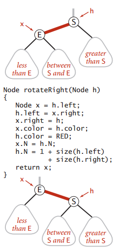
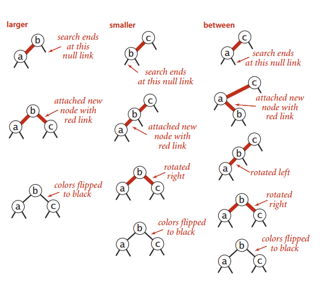
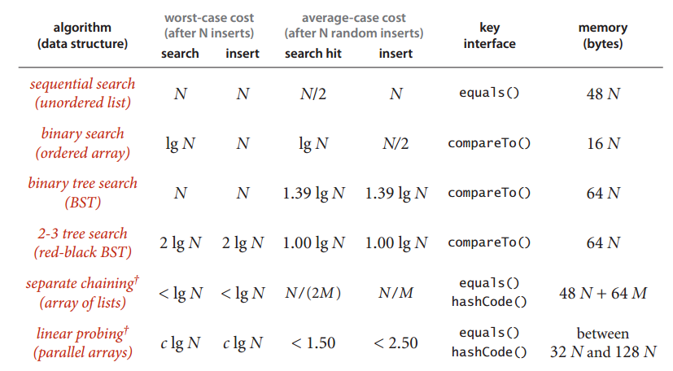

#[二叉搜索树（B树](template_bitreesearchst.h)

# 红黑树

### 基础的旋转操作



### [插入操作](my_rb_tree_insert.cpp)

- 我们对于一个节点分别检查这三种情况


- 通过递归的方式，我们能够实现下面的几种情况



### 其他实现

- [algo4(java)](algo4_rbtree.java)
- [other's(c++)](rbtree_others.cpp)

# AVL平衡树

### [Ref](http://www.cnblogs.com/vincently/p/4225976.html)
### [implement.h](avl_tree.h)
### [implement.cpp](avl_tree.cpp)
### TODO：添加size操作


# [B-树](http://www.cnblogs.com/oldhorse/archive/2009/11/16/1604009.html)
	
- B-树是一种多路搜索树（并不是二叉的）：

1.定义任意非叶子结点最多只有M个儿子；且M>2；

2.根结点的儿子数为[2, M]；

3.除根结点以外的非叶子结点的儿子数为[M/2, M]；

4.每个结点存放至少M/2-1（取上整）和至多M-1个关键字；（至少2个关键字）

5.非叶子结点的关键字个数=指向儿子的指针个数-1；

6.非叶子结点的关键字：K[1], K[2], …, K[M-1]；且K[i] < K[i+1]；

7.非叶子结点的指针：P[1], P[2], …, P[M]；其中P[1]指向关键字小于K[1]的子树，P[M]指向关键字大于K[M-1]的子树，其它P[i]指向关键字属于(K[i-1], K[i])的子树；

8.所有叶子结点位于同一层；
        
9.B-树的搜索，从根结点开始，对结点内的关键字（有序）序列进行二分查找，如果命中则结束，否则进入查询关键字所属范围的儿子结点；重复，直到所对应的儿子指针为空，或已经是叶子结点；
        


```
n+1>=2*(m/2)^(k-1)
k<=log[(n+1)/2]/log(m/2) + 1
```


# [B+树](http://www.cnblogs.com/oldhorse/archive/2009/11/16/1604009.html)

- B+树的设计主要是为了解决在遍历过程中可能会出现同1个节点访问多次的情况, 适合文件系统

1.其定义基本与B-树同，除了：
    
2.非叶子结点的子树指针与关键字个数相同；
    
3.非叶子结点的子树指针P[i]，指向关键字值属于[K[i], K[i+1])的子树（B-树是开区间）；
    
5.为所有叶子结点增加一个链指针；
    
6.所有关键字都在叶子结点出现；

7.对于非根节点，每个节点的第一个关键字，一定是父亲指针对应的那个关键字

8.最后一个关键字对应的指针 指向关键字属于[K[n], INF)的节点


9.最后一层的节点指针，应该是上一个节点的尾部指针指向下一个节点的头指针


# Hash表
	
### 基于拉链法散列表
  - [链式前向星,使用数组模拟](hash_tabel_linklist.cpp)

### [基于线性探索法的散列表](hash_table_liner.cpp)
  - 使用率在1/8->1/2最为适合


